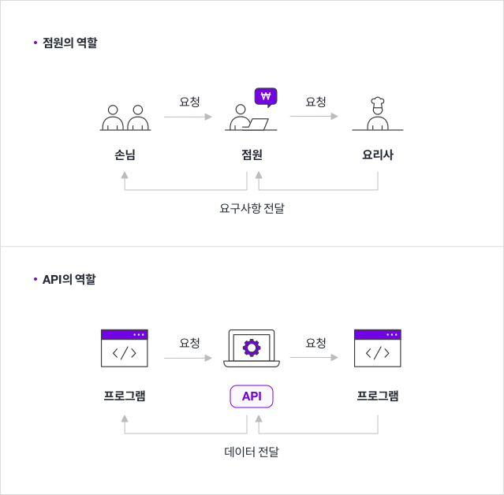

# API (Application Programming Interface) , REST API , RESTful API

응용 소프트웨어를 만드는데 쓰는 매개체나 통신규칙.

(클라이언트와 서버 사이의 데이터 전송 통신을 위한 규칙이나 룰, 방법)



1. 레스토랑에 온 손님은 점원이 가져다 준 메뉴판을 보면서 메뉴를 고른다.
2. 점원이 주문을 받아서 요리사에게 요청한다.
3. 요리사는 정성껏 음식을 만들어 점원에게 준다.
4. 손님은 점원이 가져다 준 음식을 맛있게 먹는다.

여기서 점원은 손님에게 메뉴를 알려주고, 주방에 주문받은 요리를 요청합니다.

그 다음 주방에서 완성된 요리를 손님께 다시 전달하죠.

**API** 는 점원과 같은 역할을 합니다. 

1. API는 손님 (프로그램) 이 주문할 수 있게 메뉴 (명령 목록 또는 문서) 를 정리하고,
2. 주문 (명령) 을 받으면 요리사 (응용프로그램) 와 상호작용하여
3. 요청된 메뉴 (명령에 대한 값) 를 전달합니다.

쉽게 말해, **API** 는 프로그램들이 서로 상호작용하는 것을 도와주는 매개체로 볼 수 있습니다.

## API의 역할

### API는 서버와 데이터베이스에 대한 출입구 역할을 한다.

데이터베이스에는 소중한 정보들이 저장되는데요. 모든 사람들이 이 데이터베이스에 접근할 수 있으면 안되겠죠. API는 이를 방지하기 위해 여러분이 가진 서버와 데이터베이스에 대한 출입구 역할을 하며, 허용된 사람들에게만 접근성을 부여해줍니다.

### API는 애플리케이션과 기기가 원활하게 통신할 수 있도록 한다.

여기서 애플리케이션이란 우리가 흔히 알고 있는 스마트폰 어플이나 프로그램을 말합니다. API는 애플리케이션과 기기가 데이터를 원활히 주고받을 수 있도록 돕는 역할을 합니다.

### **API는 모든 접속을 표준화한다.**

API는 모든 접속을 표준화하기 때문에 기계/ 운영체제 등과 상관없이 누구나 동일한 액세스를 얻을 수 있습니다. 쉽게 말해, API는 범용 플러그처럼 작동한다고 볼 수 있습니다.

  

## API의 유형

### Private API

private API는 내부 API로, 회사 개발자가 자체 제품과 서비스를 개선하기 위해 내부적으로 발행합니다. 따라서 제 3자에게 노출되지 않습니다.

### Public API

public API는 개방형 API로, 모두에게 공개됩니다. 누구나 제한 없이 API를 사용할 수 있는 게 특징입니다. 퍼블릭 API 중에서도 접속하는 대상에 대한 제약이 없는 경우 **OpenAPI** 라고 합니다.

오픈 api 사이트

- 공공데이터포털- [https://www.data.go.kr/](https://www.data.go.kr/)
- 문화데이터 광장 – [https://www.culture.go.kr/data/main/main.do](https://www.culture.go.kr/data/main/main.do)
- 카카오 : [](https://developers.kakao.com/)[https://developers.kakao.com/tool](https://developers.kakao.com/tool)

### Partner API

partner API는 기업이 데이터 공유에 동의하는 특정인들만 사용할 수 있습니다. 비즈니스 관계에서 사용되는 편이며, 종종 파트너 회사 간에 소프트웨어를 통합하기 위해 사용됩니다.

## API 장점

API를 사용하면 많은 이점들이 있는데요. Private API를 이용할 경우, 개발자들이 애플리케이션 코드를 작성하는 방법을 표준화함으로써, 간소화되고 빠른 프로세스 처리를 가능하게 합니다. 또한, 소프트 웨어를 통합하고자 할 때는 개발자들 간의 협업을 용이하게 만들어줄 수 있죠.

public API와 partner API 를 사용하면, 기업은 타사 데이터를 활용하여 브랜드 인지도를 높일 수 있습니다. 뿐만 아니라 고객 데이터베이스를 확장하여 전환율까지 높일 수 있지요.

# REST (Representational State Transfer) API

## REST API의 탄생

2000년도에 로이 필딩 (Roy Fielding)의 박사학위 논문에서 최초로 소개되었습니다. 로이 필딩은 HTTP의 주요 저자 중 한 사람으로 그 당시 웹(HTTP) 설계의 우수성에 비해 제대로 사용되어지지 못하는 모습에 안타까워하며 웹의 장점을 최대한 활용할 수 있는 아키텍처로써 REST를 발표했다고 합니다.

REST API는 **HTTP** 를 이용하고, 컴퓨터를 실행 시키는 명령이라고 할 수 있습니다.

그런데, REST API는 내 컴퓨터가 아니라 남의 컴퓨터를 실행시킵니다.


예를 들어 위 주소를 입력하면 트위터에 있는 글들을 가져올 수 있고, 데이터를 수정하거나 추가 , 삭제도 가능합니다.

REST API는 어떠한 기술이 아니라 HTTP의 장점을 최대한 뽑아서 쓸 수 있게 만든 모범사례라 할 수 있습니다.


블로그나 SNS 같은 서비스를 운영한다고 했을 때, 하나하나의 글들을 topic이라고 부르기도 했습니다. 데이터는 위와 같이 생겼을 것이구요. 

REST API에서는 이러한 데이터들을 **Resource** 라고 부릅니다.

리소스는 URI를 통해 표현되는데,


### Collection

전체 혹은 여러개의 글들을 식별하고 싶다면, [http://example.com/topics](http://example.com/topics) 와 같은 URI를 사용하면 됩니다. 

이러한 것을 **Collection** 이라고 부릅니다. 

컬렉션은 topics 처럼 복수형을 사용합니다.

### Element

한 건 한건의 데이터들은 Element 라고 부릅니다. 즉, 컬렉션은 엘리먼트가 모여있는 것이 컬렉션 입니다.

URI는 정보를 식별하는 이름일 뿐이고, 이것만 가지곤 아무것도 할 수 없습니다. 

이 정보를 가공할 수 있어야 합니다.

정보에 대한 가공방법은 C R U D 가 있습니다.

### CRUD

C (Create) 생성

R (Read) 읽기

U (Update) 수정

D (Delete) 삭제

이러한 작업들을 REST API에서는 Method 라고 부릅니다.

### Create

생성 작업을 위한 메소드는 POST 를 사용합니다.

폼을 이용해서 데이터를 전송할 때 수정,생성,삭제를 할 때 모두 POST를 쓰지만,

사실 POST는 생성 작업을 위해 존재한 것입니다.

**REST API는 HTTP 들의 메소드들을 본래 용도에 맞게 쓰자는 것도 중요한 목표입니다.**

그래서 우리는 생성 작업은 POST만을 쓰기로 정한 것입니다.

### Read

읽기는 GET을 사용합니다.

### Update

수정은 전체 내용을 교체하는 PUT과 일부분만 바꿔주는 Patch가 있습니다.

### Delete

삭제는 delete를 사용합니다.

## POST

```json
{
  "topics": [
    {
      "id": 1,
      "title": "REST",
      "body": "REST is ..."
    }
  ],
  "comments": [
    {
      "id": 1,
      "body": "POST is ...",
      "topicId": 1
    },
    {
      "id": 2,
      "body": "READ comments is ...",
      "topicId": 1
    }
  ]
}
```

위 데이터에서 다음과 같은 코드를 통해 데이터를 추가하려고 합니다.

```jsx
fetch('topics', {
    method:'POST', 
    headers:{'content-type':'application/json'},
    body:JSON.stringify({
        title:'fetch', body:'fetch is ...'
    })
})
    .then(
        function(response){
            console.log('status', response.status);
            return response.json()
        }
    )
    .then(
        function(result){
            console.log(result);
        }
    )
```

topics에 객체를 json 형태로 바꿔서 추가할 것이기 때문에, 서버한테 내가 만든 데이터는 json이다 라고 알려주기 위해  `'content-type':'application/json'`  를 명시합니다.

데이터 생성은 POST로 쓰기로 했으니까 method 에는 POST를 적습니다.


생성이 완료되면 개발자 도구 네트워크 탭에서 위와 같이 상세하게 볼 수 있습니다.

Status Code 201 은 데이터 생성이 성공적으로 끝났을 때 알려주는 번호입니다.

REST API에서는 서버가 어떤 일을 처리하고 처리한 일에 대한 결과를 응답코드와 응답 메시지로 출력하게 됩니다.

[REST API Status Code](https://www.notion.so/REST-API-Status-Code-54eae4c41a8d4354b728ccc476dd2cb8?pvs=21)


클라이언트에 응답한 데이터는 위와 같은 데이터임을 확인할 수 있고,

이 데이터가 어떤 타입인지는


응답헤더에서 `Content-Type` 부분을 보면 알 수 있습니다.

서버가 클라이언트에게 이 데이터의 타입은 json이다 라고 알려주고 있는 것이죠.

```json
{
  "topics": [
    {
      "id": 1,
      "title": "REST",
      "body": "REST is ..."
    },
    {
      "title": "fetch",
      "body": "fetch is ...",
      "id": 2
    }
    
  ],
  "comments": [
    {
      "id": 1,
      "body": "POST is ...",
      "topicId": 1
    },
    {
      "id": 2,
      "body": "READ comments is ...",
      "topicId": 1
    }
  ]
}
```

topics에 POST 요청을 날렸기 때문에, 위처럼 데이터가 하나 더 추가되게 됩니다.

## GET

데이터를 가져올 때는 전체를 가져오는 방법 (컬렉션) , 부분적으로 가져오는 방법 (엘리먼트) 이 있습니다.

```jsx
fetch('topics', 
	{
		method:'GET'
	}
)

.then(
    function(response){
        return response.json()
    }
)
.then(
    function(result){
        console.log(result);
    }
)
```

컬렉션을 가져오려면 위 데이터에서 topics라고 적어주면 됩니다.


이렇게 성공적으로 데이터를 가져왔습니다.

```jsx
fetch('topics/2')
.then(
    function(response){
        return response.json()
    }
)
.then(
    function(result){
        console.log(result);
    }
)
```

엘리먼트를 가져온다면, `topics/식별자` 라고 적어주면 됩니다. `topics/` 뒤에 식별자를 추가해서 가져오면 됩니다. 

## Put & Patch

데이터 수정은 두 가지 방법이 있습니다.

전체 수정을 하는 Put과 부분만 수정하는 Patch.

### Patch

```json
{
    "title": "fetch",
    "body": "fetch is ...",
    "id": 2
},
```

데이터에서 2번째 객체를 수정하고 싶다면 다음과 같이 코드를 작성하면 됩니다.

```jsx
fetch('topics/2', {
    method:'PATCH', 
    headers:{'content-type':'application/json'},
    body:JSON.stringify({
        title:'fetch - patch'
    })
})
    .then(
        function(response){
            return response.json()
        }
    )
    .then(
        function(result){
            console.log(result);
        }
    )
```

 `topics/2` 라고 지정 해주고 title을 fetch 에서 fetch - patch라고 수정해달라고 작성했습니다.

 


실행하면 2번째 객체의 title만 변경되었고, body는 그대로 있게 됩니다.

이처럼 Patch는 전송하지 않은 데이터는 삭제되지 않고 그대로 냅둡니다.

### Put

```jsx
fetch('topics/2', {
    method:'PUT', 
    headers:{'content-type':'application/json'},
    body:JSON.stringify({
        title:'fetch - put'
    })
})
    .then(
        function(response){
            return response.json()
        }
    )
    .then(
        function(result){
            console.log(result);
        }
    )
```

Put은 Patch와는 조금 다릅니다. 전체 데이터를 교체 하는 것이기 때문에 위 코드를 실행하면,


작성한대로 title이 변경되는데, body가 사라지게 됩니다.

이처럼 Put은 식별자인 id를 제외한 전송하지 않은 데이터는 삭제됩니다.

### Delete

데이터를 삭제합니다.

```jsx
fetch('topics/2', {
    method:'DELETE'
})
    .then(
        function(response){
            return response.json()
        }
    )
    .then(
        function(result){
            console.log(result);
        }
    )
```

리소스를 `topics/2` 로 지정하고 method를 DELETE로 지정해주면, 2번째 객체가 삭제됩니다.

```jsx
fetch('topics', {
    method:'DELETE'
})
    .then(
        function(response){
            return response.json()
        }
    )
    .then(
        function(result){
            console.log(result);
        }
    )
```

 컬렉션을 삭제하려면 리소스를 `topics` 라고 지정해주면 되는데, 위험한 명령이기 때문에 이런 부분은 안되는 경우가 많습니다.


Status Code를 보면 404라고 뜨네요.

## 관계

```json
{
  "topics": [
    {
      "id": 1,
      "title": "REST",
      "body": "REST is ..."
    },
    {
      "title": "fetch - put",
      "id": 2
    }
  ],
  "comments": [
    {
      "id": 1,
      "body": "POST is ...",
      "topicId": 1
    },
    {
      "id": 2,
      "body": "READ comments is ...",
      "topicId": 1
    }
  ]
}
```

REST API에서 위와 같이 리소스가 리소스끼리 관계를 맺고있을 때 애매할 수 있습니다.

topics는 comments를 포함하고 있는 상태입니다. 두 개의 댓글은 REST is… 라고 하는 글 하나에 종속되어 있다는 관계를 맺고 있습니다.

이 때, 이러한 관계를 URI로 어떻게 표현하는가가 문제가 될 수 있습니다.

```jsx
fetch('topics/1/comments', {
    method:'GET'
})
.then(
    function(response){
        return response.json()
    }
)
.then(
    function(result){
        console.log(result);
    }
)
```

위 코드에선 `topcis/1/comments` 라고 지정해주었습니다.

1. 부모가 되는 것을 먼저 적고,
2. 그 부모에 엘리먼트의 id값을 적고,
3. 자식이 되는 리소스의 이름을 적어주면 됩니다.

## 정리

REST API는 기계와 기계가 HTTP를 통해 통신할 때

1. 리소스는 URI로 표현
2. 행위는 메소드
3. 결과는 응답 코드로 출력

HTTP가 원래 가지고 있는 의미를 잘 활용하자! 라는 것이라고 할 수 있습니다.

## RESTful API

**RESTFUL이란 REST의 원리를 따르는 시스템을 의미합니다. 하지만 REST를 사용했다 하여 모두가 RESTful 한 것은 아닙니다.  REST API의 설계 규칙을 올바르게 지킨 시스템을 RESTful하다 말할 수 있으며**

**모든 CRUD 기능을 POST로 처리 하는 API 혹은 URI 규칙을 올바르게 지키지 않은 API는 REST API의 설계 규칙을 올바르게 지키지 못한 시스템은 REST API를 사용하였지만 RESTful 하지 못한 시스템이라고 할 수 있습니다.**

### 참고

[https://www.youtube.com/watch?v=PmY3dWcCxXI](https://www.youtube.com/watch?v=PmY3dWcCxXI)

[https://www.youtube.com/watch?v=iOueE9AXDQQ](https://www.youtube.com/watch?v=iOueE9AXDQQ)

[https://khj93.tistory.com/entry/네트워크-REST-API란-REST-RESTful이란](https://khj93.tistory.com/entry/%EB%84%A4%ED%8A%B8%EC%9B%8C%ED%81%AC-REST-API%EB%9E%80-REST-RESTful%EC%9D%B4%EB%9E%80)