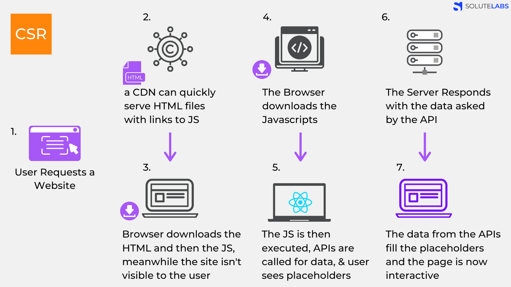

# CSR & SSR

## CSR (Client Side Rendering)

말 그대로 렌더링이 클라이언트쪽에서 일어납니다.

즉, 서버는 요청을 받으면 클라이언트에 HTML과 JS를 보냅니다.

클라이언트는 그것을 받아 렌더링을 시작합니다.

CSR 단계 설명 이미지

1. 유저가 웹사이트 요청을 보냄.
2. CDN이 HTML 파일과 JS로 접근할 수 있는 링크를 클라이언트로 보냄.
3. 클라이언트는 HTML과 JS를 다운로드 받음.
(이 때 유저는 SSR과 달리 아무것도 볼 수 없음)
4. 브라우저가 JS를 다운로드 받음. (3번과 동일)
5. 다운로드가 완료된 JS가 실행됨. 데이터를 위한 API가 호출됨.
(이때 유저들은 placeholder를 보게됨)
6. 서버가 API로부터의 요청에 응답함.
7. API로부터 받아온 데이터를 placeholder 자리에 넣어줌. 이제 페이지는 상호작용이 가능해짐.

⇒ 즉, 서버에서 처리 없이 클라이언트로 보내주기 때문에 JS가 모두 다운로드 되고 실행이 끝나기 전까지는 사용자는 볼 수 있는게 없음.

## SSR (Server Side Rendering)

말 그대로 서버쪽에서 렌더링 준비를 끝마친 상태로 클라이언트에 전달하는 방식입니다.

SSR 단계 설명 이미지

1. 유저가 웹사이트 요청을 보냄.
2. 서버는 즉시 렌더링 가능한 HTML 파일을 만듦.
(리소스 체크, 컴파일 후 완성된 HTML 컨텐츠로 만듦)
3. 클라이언트에 전달되는 순간, 이미 렌더링 준비가 되어있기 때문에 HTML은 즉시 렌더링 됨. 그러나 사이트 자체는 조작 불가능. 
(JS가 읽히기 전이기 때문에)
4. 클라이언트가 JS를 다운 받음.
5. 다운로드 중에 유저는 컨텐츠를 볼 수는 있지만 사이트 조작은 할 수 없음. 이 때의 사용자 조작을 기억하고 있음.
6. 브라우저가 JS 프레임워크를 실행.
7. JS까지 성공적으로 컴파일 되었기 때문에 기억하고 있던 사용자 조작이 실행되고 이제 웹 페이지는 상호작용이 가능해짐.

⇒ 즉, 서버에서 이미 **렌더 가능한** 상태로 클라이언트에 전달되기 때문에 JS가 다운로드 되는 동안 사용자는 무언가를 보고 있을 수 있음.

## CSR과 SSR 차이

### 1. 웹페이지를 로딩하는 시간

- 하나는 웹 사이트의 가장 첫 페이지를 로딩하고, 다른 하나는 나머지를 로딩하는 것으로 2가지로 나눌 수 있습니다.

### 2. 첫 페이지 로딩시간

- CSR의 경우 HTML , CSS , JS를 한번에 불러옵니다. 반면에 SSR은 필요한 부분의 HTML과 스크립트만 불러옵니다.
- 따라서 평균적으로 SSR이 더 빠릅니다.

### 3. 나머지 로딩 시간

- 첫 페이지를 로딩한 후, 사이트의 다른 곳으로 이동하는 식의 동작을 가정했을 때,  CSR은 이미 첫 페이지 로딩할 때 나머지 부분을 구성하는 코드를 받아왔기 때문에 빠릅니다.
- 반면 SSR은 첫 페이지 로딩이 느리기 때문에 이럴경우엔 CSR이 더 빠릅니다.

### 4. SEO 대응

- 대부분의 웹 크롤러 , 봇들은 JS를 실행시키지 못하고 HTML에서만 컨텐츠를 수집하기 때문에 CSR 방식으로 개발된 페이지들은 빈 페이지로 인식하게 됩니다.
- SSR 방식은 서버에서 전부 렌더링하기 때문에 HTML에 모든 컨텐츠가 저장되어있어 SEO를 사용하는데 문제가 없습니다.

### 5. 서버 자원 사용

SSR이 서버 자원을 더 많이 사용합니다. 매번 서버에 요청을 하기 때문입니다. 그런 반면 CSR은 서버 대신 클라이언트쪽을 더 많이 사용하기 때문에 서버 부하가 적습니다.

### 참고

[https://hahahoho5915.tistory.com/52](https://hahahoho5915.tistory.com/52)

[https://velog.io/@ksh4820/SPA-CSR과-SSR-SEO](https://velog.io/@ksh4820/SPA-CSR%EA%B3%BC-SSR-SEO)

[https://github.com/baeharam/Must-Know-About-Frontend/blob/main/Notes/frontend/csr-ssr.md](https://github.com/baeharam/Must-Know-About-Frontend/blob/main/Notes/frontend/csr-ssr.md)