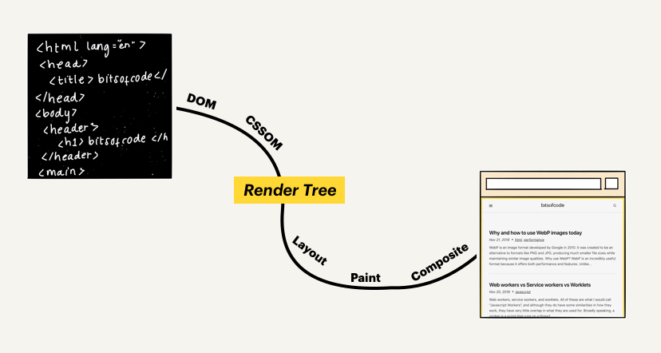

# DOM (Document Object Model)

## DOM이 무엇인가요?

DOM은 웹 페이지에 대한 인터페이스입니다. 기본적으로 여러 프로그램들이 페이지의 콘텐츠 및 구조, 그리고 스타일을 읽고 조작할 수 있도록 API를 제공합니다.

## 웹 페이지는 어떻게 만들어질까?

웹 브라우저가 원본 HTML 문서를 읽어들인 후, 스타일을 입히고 대화형 페이지로 만들어 뷰 포트에 표시하기까지의 과정을 “Critical Rendering Path” 라고 합니다.

이 과정은 여러 단계로 나누어져 있지만, 이 단계들을 대략 두 단계로 나눌 수 있습니다. 첫 번째 단계에서 브라우저는 읽어들인 문서를 파싱하여 최종적으로 어떤 내용을 페이지에 렌더링할지 결정합니다. 그리고, 두 번째 단계에서 브라우저는 해당 렌더링을 수행합니다.

첫 번째 과정을 거치면 **렌더 트리**가 생성됩니다.

렌더 트리는 웹 페이지에 표시될 HTML 요소들과 이와 관련된 스타일 요소들로 구성됩니다. 브라우저는 렌더 트리를 생성하기 위해 다음과 같이 두 모델이 필요합니다.

- DOM(Document Object Model) – HTML 요소들의 구조화된 표현
- CSSOM(Cascading Style Sheets Object Model) – 요소들과 연관된 스타일 정보의 구조화된 표현

## ****DOM은 어떻게 생성될까 (그리고 어떻게 보여질까)?****

DOM은 원본 HTML 문서의 객체 기반 표현 방식입니다.

DOM의 개체 구조는 “노드 트리”로 표현됩니다. 하나의 부모 줄기가 여러 개의 자식 나뭇가지를 갖고 있고, 또 각각의 나뭇가지는 잎들을 가질 수 있는 나무와 같은 구조로 이루어져 있기 때문입니다. 이 케이스의 경우, 루트 요소인 `html` 은 “부모 줄기”, 루트 요소에 내포된 태그들은 “자식 나뭇가지” 그리고 요소 안의 컨텐츠는 “잎”에 해당합니다.

아래 HTML 예시에서,

이 문서는 아래와 같은 노드 트리로 표현됩니다.

## DOM이 아닌 것

### 1. DOM은 HTML이 아닙니다.

DOM은 HTML 문서로부터 생성되지만 항상 동일하지 않습니다. DOM이 원본 HTML 소스와 다를 수 있는 두 가지 케이스가 있습니다.

**작성된 HTML 문서가 유효하지 않을 때**

DOM은 유효한 HTML 문서의 인터페이스 입니다. DOM을 생성하는 동안, 브라우저는 유효하지 않은 HTML 코드를 올바르게 교정합니다.

아래 예시를 살펴보시면,

문서에 유효한 HTML 규칙의 필수 사항인 `<head>` 와 `<body>` 요소가 빠져있습니다. 그렇지만 생성된 DOM 트리에는 올바르게 교정되어 나타납니다.

**자바스크립트에 의해 DOM이 수정될 때**

DOM은 HTML 문서의 내용을 볼 수 있는 인터페이스 역할을 하는 동시에 동적 자원이 되어 수정될 수 있습니다.

예를 들어, 자바스크립트를 사용해 DOM에 새로운 노드를 추가할 수 있습니다.

이 코드는 DOM을 업데이트합니다. 하지만 HTML 문서의 내용을 변경하진 않습니다.

### 2. DOM은 브라우저에서 보이는 것이 아닙니다.

브라우저 뷰 포트에 보이는 것은 렌더 트리로 DOM과 CSSOM의 조합입니다. 렌더 트리는 오직 스크린에 그려지는 것으로 구성되어 있어 DOM과 다릅니다.

달리 말하면, 렌더링 되는 요소만이 관련 있기 때문에 시각적으로 보이지 않는 요소는 제외됩니다.

예를 들어, `display: none` 스타일 속성을 가지고 있는 요소입니다.

DOM은  `
` 요소를 포함시킵니다.

그러나 렌더 트리에 해당하는 뷰 포트에 표시되는 내용은 `
` 요소를 포함하지 않습니다.

### ****3. DOM은 개발도구에서 보이는 것이 아닙니다.****

개발도구의 요소 검사기는 DOM과 가장 가까운 근사치를 제공합니다. 그러나 개발도구의 요소 검사기는 DOM에 없는 추가적인 정보를 포함합니다.

가장 좋은 예는 CSS의 가상 요소입니다. `::before`과 `::after`선택자를 사용하여 생성된 가상 요소는 CSSOM과 렌더 트리의 일부를 구성합니다.

하지만, 기술적으로 DOM의 일부는 아닙니다. DOM은 오직 원본 HTML 문서로부터 빌드 되고, 요소에 적용되는 스타일을 포함하지 않기 때문입니다.

가상 요소가 DOM의 일부가 아님에도 불구하고, 요소 검사기에서는 아래와 같이 확인됩니다.

이러한 이유로 가상 요소는 DOM의 일부가 아니기 때문에 자바스크립트에 의해 수정될 수 없습니다.

### 요약

DOM은 HTML 문서에 대한 인터페이스입니다. 첫째로 뷰 포트에 무엇을 렌더링 할지 결정하기 위해 사용되며,

둘째로는 페이지의 콘텐츠 및 구조, 그리고 스타일이 자바스크립트 프로그램에 의해 수정되기 위해 사용됩니다.

DOM은 원본 HTML 문서 형태와 비슷하지만 몇 가지 차이점이 있습니다.

- 항상 유효한 HTML 형식입니다.
- 자바스크립트에 수정될 수 있는 동적 모델이어야 합니다.
- 가상 요소를 포함하지 않습니다. (Ex. `::after`)
- 보이지 않는 요소를 포함합니다. (Ex. `display: none`)

### 참고

[https://wit.nts-corp.com/2019/02/14/5522](https://wit.nts-corp.com/2019/02/14/5522)

[https://d2.naver.com/helloworld/59361](https://d2.naver.com/helloworld/59361)

[https://developer.mozilla.org/ko/docs/Web/API/Document_Object_Model/Introduction](https://developer.mozilla.org/ko/docs/Web/API/Document_Object_Model/Introduction)