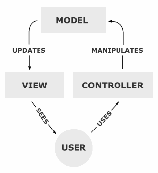

# MVC 패턴 (Model-View-Controller)



MVC는 소프트웨어가 서비스하는 방식에 대한 패턴을 지칭합니다.

하나의 파일 안에서 변수들을 다루고, 데이터베이스에 접속하고, 사용자에게 보여질 HTML 부분들을 짜고…. 이렇게 되면 코드가 굉장히 난잡해지고 유지보수 하기도 힘들 것입니다.

간단한 게시판 사이트면 몰라도, 네이버처럼 대규모 사이트를 제작하기엔 너무나 힘들겠죠.

그래서 보통 코드가 거대해지거나 복잡해질 땐, 특정 기준으로 분리, 모듈화해서 접근하죠.

국가기관을 입법,사법,행정으로 나누듯이 웹 사이트를 비롯한 소프트웨어에는 MVC 라는 접근법이 많이 사용됩니다.

## Model

데이터와 관련된 것들을 처리합니다. 게시판을 예로 들어본다면, 게시판에 쓰이고 읽히고 수정되는 글들은 DB에 데이터로 저장됩니다.

이 데이터의 형식을 지정하고, 저장하고 불러오는 작업들에 관한 코드들이 Model 에서 이루어집니다.

- Model은 **Data**와 애플리케이션이 **무엇**을 할 것인지를 정의하는 부분으로 **내부 비즈니스 로직을 처리하기 위한 역할**을 합니다.
- 즉, 모델은 컨트롤러가 호출을 하면 DB와 연동하여 사용자의 입출력 데이터를 다루는 일과 같은 데이터와 연관된 비즈니스 로직을 처리하는 역할을 합니다.
- 데이터 추출, 저장, 삭제, 업데이트 등의 역할을 수행합니다.

## View

간단히 말하자면 HTML , CSS로 사용자에게 보여주는 화면들이 View 입니다.

- 사용자에게 보여주는 화면
- 사용자와 상호작용을 하며 컨트롤러로부터 받은 모델의 결과값을 사용자에게 화면으로 출력하는 일을 합니다.
- MVC에서는 여러개의 View가 존재할 수 있습니다.
- Model에서 받은 데이터는 별도로 저장하지 않습니다.

## Controller

Model의 데이터를 View에 연결해서 사용자가 GUI 화면을 통해 데이터를 읽고 쓰고 지우고 할 수 있도록 전반적인 제어를 Controller에서 진행하게 됩니다.

- Controller는 **Model과 View 사이를 이어주는 인터페이스 역할**을 합니다.
- 즉, **Model이 데이터를 어떻게 처리할지 알려주는 역할**을 합니다.
- 사용자로부터 View에 요청이 있으면 Controller는 해당 업무를 수행하는 Model을 호출하고 Model이 업무를 모두 수행하면 다시 결과를 View에 전달하는 역할을 합니다.

## MVC 다섯가지 규칙

### 1. Model은 Controller와 View에 의존하지 않아야 한다.

⇒ Model 내부에 Controller와 View에 관련된 코드가 있으면 안된다.

⇒ 모델은 데이터가 관련된 부분이다 보니 언제든 깔끔하고 정제된 데이터를 꺼내쓸 수 있게 뷰나 컨트롤러에 코드를 섞어서 넣지 않음.

### 2. View는 Model에만 의존해야 하고, Controller에는 의존하면 안된다.

⇒ View 내부에 Model의 코드만 있을 수 있고, Controlller의 코드가 있으면 안된다.

### 3. View가 Model로부터 데이터를 받을 때는, 사용자마다 다르게 보여주어야 하는 데이터에 대해서만 받아야 한다.


해당 화면을 보면 크게 두 가지로 나눌 수 있습니다.

사용자마다 다르게 보여줘야 되는 부분들과 사용자한테 일관되게 똑같이 보여줘야되는 부분들.

강동구 길동 123-45나 남구 용현동 987-65 같은 것들은 주소이기 때문에, 사용자마다 다르게 보여주어야 합니다.


즉, View는 사용자한테 보이는 UI와 Model로 부터 받은 데이터가 합쳐져 만들어진 화면입니다.

여기서 중요한건 모든 사용자한테 똑같이 보여져야 하는 부분들.

주문하기 타이틀이나 배달정보 , 어플 배경은 하얀색… 이러한 정보들은 Model로 부터 받으면 안되고 **View가 자체적으로 가지고 있어야 하는 정보들** 이어야 합니다.

### 4. Controller는 Model과 View에 의존해도 된다.

⇒ Controller 내부에는 Model과 View의 코드가 있을 수 있다.

컨트롤러는 모델과 뷰의 중개자 역할을 하면서 전체 로직을 구성하기 때문.

### 5. View가 Model로부터 데이터를 받을 때, 반드시 Controller에서 받아야한다.

뷰가 모델로부터 데이터를 받을 때에는 **컨트롤러 코드 내에서 코드 안에서만** 받아야합니다.

## MVC 장점

- 기능별로 코드를 분리하여 하나의 파일에 코드가 모이는 것을 방지하여 가독성과 코드의 재사용이 증가한다.
- 각 구성요소들을 독립시켜 협업을 할 때 맡은 부분의 개발에만 집중할 수 있어 개발의 효율성을 높여준다. <- 분업을 가능하게 해준다!!!
- 개발 후에도 유지보수성과 확장성이 보장된다.

## MVC 예시 코드

```jsx
http://yourapp.com/users/profile/1

/routes // 엔드포인트로 요청이 들어오면 라우터에 우선 걸린다.
  users/profile/:id = Users.getProfile(id)

/controllers // 모델을 통해 데이터를 받아오면(+가공) 뷰로 보낸다.
  class Users{
    function getProfile(id) {
      profile = this.UserModel.getProfile(id)
      renderView('users/profile', profile);
    }
  }

/models // 실제 데이터베이스에 접근해서 데이터를 받아온다.
  class UserModel {
    fucntion getProfile(id) {
      data = this.db.get('SELECT * from users WHERE id = id')
      return data;
    }
  }

/view // 받은 데이터를 다이나믹하게 이용해서 뷰로 보여준다.
  /users
    /profile
    <h1>{{profile.name}}</h1>
    <ul>
      <li>Email: {{profile.email}}</li>
      <li>Phone: {{profile.Phone}}</li>
    </ul>
```

## MVC의 한계

MVC에서 View는 Controller에 연결되어 화면을 구성하는 단위요소이므로 다수의 View들을 가질 수 있습니다. 그리고 Model은 Controller를 통해서 View와 연결되어지지만, 이렇게 Controller를 통해서 하나의 View에 연결될 수 있는 Model도 여러개가 될 수 있습니다.

즉, 화면에 복잡한 화면과 데이터의 구성 필요한 구성이라면, Controller에 다수의 Model과 View가 복잡하게 연결되어 있는 상황이 생길 수 있습니다.


MVC가 너무 복잡하고 비대해져서, 새 기능을 추가할때마다 크고 작은 문제점을 가지고 소드 분석이나 테스트도 어렵죠. 이런 형태의 MVC를

**Massive ViewController (대규모 MVC 어플리케이션)**

라고 부릅니다. MVC의 한계를 표현한 용어 인 것 같습니다.

그래서 위의 문제점을 보완한 여러 다양한 패턴이 존재합니다. 

MVP,MVVM,Clean Architecture,Flux,Redux 등등….

### 참고

[https://cocoon1787.tistory.com/733](https://cocoon1787.tistory.com/733)

[https://velog.io/@seongwon97/MVC-패턴이란](https://velog.io/@seongwon97/MVC-%ED%8C%A8%ED%84%B4%EC%9D%B4%EB%9E%80)

[https://www.youtube.com/watch?v=AERY1ZGoYc8](https://www.youtube.com/watch?v=AERY1ZGoYc8)

[https://hanamon.kr/mvc란-mvc-design-pattern/](https://hanamon.kr/mvc%EB%9E%80-mvc-design-pattern/)

[https://medium.com/@jang.wangsu/디자인패턴-mvc-패턴이란-1d74fac6e256](https://medium.com/@jang.wangsu/%EB%94%94%EC%9E%90%EC%9D%B8%ED%8C%A8%ED%84%B4-mvc-%ED%8C%A8%ED%84%B4%EC%9D%B4%EB%9E%80-1d74fac6e256)

[https://www.youtube.com/watch?v=ogaXW6KPc8I](https://www.youtube.com/watch?v=ogaXW6KPc8I)