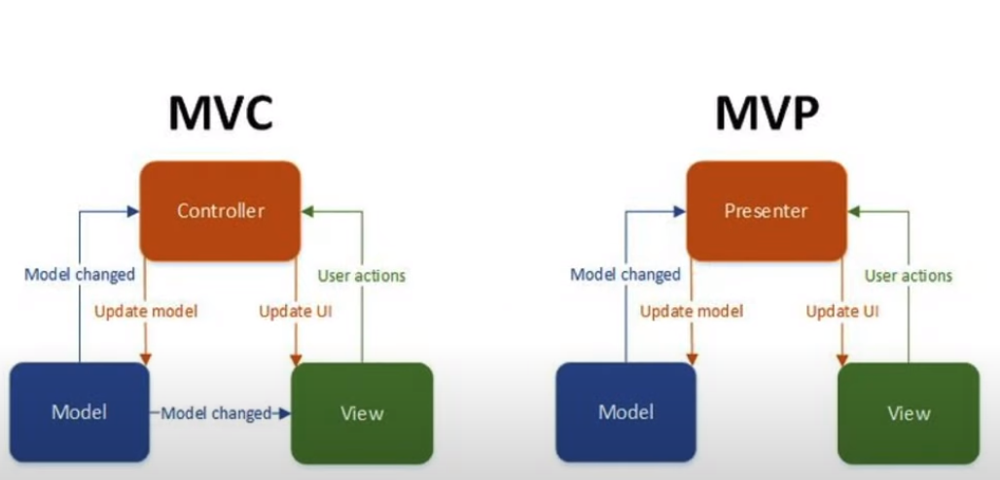

# MVP (Model - View - Presenter)

MVP 패턴은 기존 MVC에서 controller 역할을 presenter가 대신 하게 됩니다.

구조를 보면, MVC에서는 Model이 View 직접적으로 바꿀 수 있는 형태입니다.

MVP에서는 모든 Model이나 View를 변경할 때 중간에서 제어해주는 친구인 Presenter의 허락을 받아야지만 변경할 수 있습니다.

MVC와 MVP의 가장 큰 차이점은 **Model이 View를 직접적으로 컨트롤하지 않는다**

즉, Model과 View는 서로 분리되어있다는 점입니다.

MVC는 Model이 View를 손쉽게 변경할 수 있는 구조로 되어있습니다.

MVP는 presenter라는 개념이 새로 도입이 됩니다.

컨트롤러는 기존 권한들을 모두 presenter에게 주고, 단지 정보만 입력받는  **interface** 로 변환됩니다.

presenter가 View와 Model를 제어하게 되고, 가장 중요한건 Model이 View를 직접적으로 제어할 수 없도록 만든다는 것!

## MVP 장점

비슷한 종류의 엑티비티가 하나 더 생겼을 때, 손쉽게 presenter를 그대로 이식할 수 있는 장점이 있기 때문에, View와 Model 사이의 의존성이 없어지게 됩니다.

### 참고

[https://www.youtube.com/watch?v=LyYRTcyKJIU](https://www.youtube.com/watch?v=LyYRTcyKJIU)