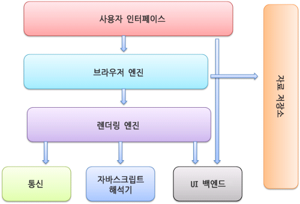

# 브라우저 동작 과정

## 브라우저의 주요 기능

브라우저의 주요 기능은 **사용자가 선택한 자원을 서버에 요청**하고 **브라우저에 표시**하는 것입니다.

자원은 보통 HTML이지만, PDF나 이미지 또는 다른 형태일 수도 있습니다.

자원의 주소는 URI에 의해 정해집니다.

브라우저는 HTML과 CSS 명세에 따라 HTML 파일을 해석해서 표시하는데, 이 명세는 웹 표준화 기구인 **W3C** 에서 정합니다. 과거에는 브라우저마다 독자적인 방법으로 구현을 해서

웹 제작자가 심각한 호환성 문제를 겪었지만, 최근에는 대부분의 브라우저가 표준 명세를 따르고 있습니다.

다음은 브라우저의 사용자 인터페이스입니다.

- uri를 입력할 수 있는 주소 표시 줄
- 이전 / 다음 버튼
- 북마크
- 새로고침 버튼과 현재 문서의 로드를 중단할 수 있는 정지 버튼
- 홈 버튼

## 브라우저의 기본 구조



1. 사용자 인터페이스 : 요청한 페이지를 보여주는 창 외의 모든 UI (주소창, 뒤로가기, 앞으로가기 , 새로고침 버튼 등…)
2. 브라우저 엔진 : 사용자 인터페이스와 렌더링 엔진 사이에서 중개자 역할. 
사용자 인터페이스 영역에 있는 새로고침 버튼을 눌렀다면, 브라우저 엔진은 이를 이해하고 새로고침 명령을 수행.
3. 렌더링 엔진 : HTML,CSS,JS를 파싱하고 그 결과물을 바탕으로 페이지를 그려내는 역할.
4. 통신 (네트워크) : HTTP나 HTTPS 같은 프로토콜을 이용해 외부의 리소스를 얻어오고, 서버에 요청을 보낼 때 사용.
5. 자바스크립트 해석기 : 자바스크립트를 해석하고 실행.
6. UI 백엔드 : 브라우저가 동작하고 있는 운영체제의 인터페이스를 따르는 UI를 처리.
(브라우저 자체 기본 얼럿이나 셀렉트박스)
7. 자료 저장소 : 브라우저 자체에서 데이터를 로컬에 저장하기 위한 레이어로,
쿠키나 로컬스토리지 , 세션 스토리지, indexedDB 등에 접근하고 데이터를 저장하는데 사용.

## 렌더링 엔진

- 크롬 / 오페라 / 엣지 : Blink

(Blink : 크롬 28 부터 애플이 개발한 웹킷 엔진을 복제하여 만든 구글 자체 엔진을 탑재함.
기존 웹킷의 원소스를 복사해서 수정하는식으로 개발을 해서 사실상 같은거라고 해도 될듯)
- 파이어폭스 : Gecko
- 인터넷 익스플로러 : Trident
- 사파리 : Webkit

## 렌더링 엔진 동작 과정


1. HTML 문서를 파싱하고 **콘텐츠 트리** 내부에서 태그를 DOM 노드로 변환.
- DOM Node?
    
    DOM은 Node의 계층 구조로 이루어져 있다. 각 노드는 부모와 자식을 가질 수 있다.
    
    ```html
    <!DOCTYPE html>
    <html>
      <head>
        <title>My Page</title>
      </head>
      <body>
        <!-- Page Body -->
        <h2>My Page</h2>
        <p id="content">Thank you for visiting my web page!</p>
      </body>
    </html>
    ```
    
    
    
    위 HTML 코드가 위처럼 노드 계층 형태로 표시된다. 태그 안에있는 text도 노드로 포함된다.
    
1. 스타일 요소를 파싱. 스타일 정보와 HTML 표시 규칙은 **렌더 트리** 라는 것을 생성.
⇒ 렌더 트리는 색상 또는 면적과 같은 시각적 속성들을 포함하고 있으며, 정해진 순서대로 화면에 표시됨.
2. 생성이 끝나면 배치가 시작됨. 
⇒ 이것은 각 노드가 화면에 정확한 위치에 표시되는 것을 의미.

## UI 백엔드에서의 동작과정 예

### 웹킷


### 게코


- 게코 : 
렌더트리 ⇒ 형상트리
각 요소를 형상 (frame) 이라 부름.
요소 배치를 리플로 (reflow) 라고 부름.

- 웹킷 :
렌더 객체로 구성되어있는 렌더 트리 라는 용어를 사용.
요소를 배치하는데 배치 (layout) 라는 용어를 사용.
어테치먼트는 웹킷이 렌더 트리를 생성하기 위해 DOM 노드와 시각 정보를 연결하는 과정.

게코는 HTML과 DOM 트리 사이에 콘텐츠 싱크라는 과정을 두는데,
이는 **DOM 요소를 생성하는 공정** 으로 웹킷과 큰 차이는 없음.

## 파싱

파싱은 토큰화된 코드를 구조화하는 과정입니다.

이러한 파싱 과정을 전문적으로 해주는 부분을 파서 (Parser) 라고 합니다.

⇒ 토큰화라는 것은 의미가 있는 최소 단위로 코드를 쪼개는 것을 의미합니다.
`<div></div>` 라는 코드를 토큰화하면 `['<','div','>','</','div','>']` 가 됩니다.

[파싱 (Parsing) & 파서 (Parser)](https://www.notion.so/Parsing-Parser-e032b408f47c44338fb376ba1b8705fa?pvs=21) 

## HTML 파싱

HTML 파서는 HTML 마크업을 파싱트리로 변환합니다.


- 토큰화 된 HTML 문자열을 이용하여 파스 트리를 생성
⇒ 파스 트리는 브라우저가 읽어야 할 HTML 코드를 트리 형태로 구조화하여 나타낸 것.
- 브라우저는 파스 트리를 이용해 DOM 트리를 새로 만듦.
- 파스 트리는 토큰화 된 문자열을 단순하게 구조화한 트리지만, DOM 트리는 실제로 상호작용할 수 있는 HTML 엘리먼트로 이루어진 트리임.

## HTML 파서의 특징

- 너그러운 속성
⇒ HTML 파싱 도중 어떠한 에러가 발생한다면, 브라우저는 자체적으로 에러를 복구하려 함.

```html
<body>
<p class=highlight>Hello
<div><span>World
```

위 코드는  제대로 작성되지 않은 코드입니다. 하지만 이 코드를 브랑저에서 실행 시켜보면 완성 된 코드가 나오게 됩니다.

- 파싱 과정이 중단될 수 있음
⇒ HTML은 파싱 도중 `<script>` , `<link>` 같은 외부 태그를 만나게되면 파싱을 즉시 중단함.
그리고, 해당 태그의 해석을 실행.
(해당 태그가 외부 파일을 참조하고 있다면 다운로드 한 후 해석 시작)


`<script>` 에 DOM을 직접 수정하는 내용이 있을 수도 있기 때문입니다.

`document.write()` 같은 API을 사용하면 파싱 도중에도 DOM 엘리먼트를 동적으로 삽입할 수 있습니다. 이로 인해 외부 콘텐츠를 해석하고 실행하기까지 HTML의 파싱은 중단됩니다.

⇒ 스크립트가 중간에 껴있으면 하던 HTML 파싱이 중단되기 때문에, 우리가 스크립트 태그를 body 제일 아래에 넣는 이유입니다. 자바스크립트에서 DOM 조작을 했을 때, 존재하지 않는 요소로 판단되는 것을 방지합니다. 

(제일 아래에 두면 이미 HTML 파싱을 다 마친 후에 스크립트를 실행하기 때문.)

### 예측 파싱

병렬적으로 다음 작업을 실행함.

- 스레드1 : 스크립트 실행
- 스레드2 : 네트워크로부터 다른 자원을 찾아 내려받고 문서의 나머지 부분을 파싱.

⇒ 스크립트를 실행하는동안 다른 스레드에서는 다른 작업을 실행함.

- DOM 트리 수정은 예측 파서가 아닌 메인 파서 담당.
- 예측 파서는 외부 스크립트 , 외부 스타일시트, 외부 이미지와 같이 참조된 외부 자원만을 파싱함.

---

- 재시작
⇒ HTML 파싱 과정은 어떠한 외부의 요인으로 인해 방해받을 수 있습니다.
파싱 중간에 DOM이 추가,변경,삭제될 수 있는데 이러한 경우 HTML은 처음부터
다시 파싱이 시작됩니다.

이 때문에 처리해야 할 HTML이 많으면 파싱 시간이 오래 걸릴 수 있습니다.

## CSS 파싱


- 일반적으로 css를 링크하는 코드가 HTML 내에 삽입되어있기 때문에 HTML 파싱 도중에 CSS 파싱이 시작됨.
- 네트워크를 통해 먼저 받아온 코드부터 해석을 실행할 수 있는 HTML 파서와 달리, CSS 파서는
**전체 파일을 모두 다운로드할 때까지** 파싱을 시작할 수 없음.
- 전체 파일을 다운로드 한 후, CSS 파싱 과정이 끝나게 되면 코드에서 명세한 내용과 순서를 바탕으로 CSSOM (CSS Object Model) 이라는 트리를 구성함.

해당 트리에는 스타일,규칙,선택자 등의 정보가 노드에 들어가게 됨.

## 렌더 트리


- 화면에 나타나는 요소들을 결정하는 트리.
(어떠한 요소들이 보여야하는지, 어떤 스타일,어떤 순서로 나타낼 것인지…)

⇒ 렌더 트리는 DOM 트리와 CSSOM 트리를 조합하여 만들어지고, 화면에 그려지지 않는 요소들은 트리에 나타나지 않습니다. (`<head>` , `<script>` 아니면 `display: none` 이 적용 된 요소들)

## 레이아웃 또는 리플로우

렌더 트리 구성이 끝나면 레이아웃 단계가 시작됩니다.

레이아웃 단계에서는 **렌더 트리에서 계산되지 않았던 노드들의 크기나 위치, 레이어 간 순서와 같은 정보들을 계산하여 좌표에 나타냅니다.**

### 전역적 레이아웃 (Global Layout)

- 화면 전체의 레이아웃을 계산
⇒ 새로운 폰트를 적용하거나 폰트 사이즈 변경 , 뷰포트 사이즈 변경 같은 경우가 있으면 전체 레이아웃을 다시 계산.
`offsetHeight` 같은 DOM 관련 API 사용 시에도 다시 계산 됨.
- 더디 비트 시스템으로 브라우저 자체 최적화 로직이 탑재되어 있음.
⇒ 특정 엘리먼트의 레이아웃이 변경되었을 때, 렌더 트리를 처음부터 탐색하면서 레이아웃을 계산하지 않고 특정한 부분만 다시 계산하여 리소스의 낭비를 줄이는 최적화 방법.

### 증분적 레이아웃 (Incremental Layout)

- 더티 비트 시스템을 활용하여 레이아웃의 변경이 발생해야 하는 엘리먼트들을 만나게 되면, 그 계산을 즉시 수행이 아닌 스케쥴러를 통해 비동기로 일괄 작업(batch) 을 진행. 이를 통해 연산의 횟수와 범위를 줄일 수 있음.

⇒ 하지만 아주 복잡한 레이아웃의 경우, 레이아웃 과정의 연산을 최소화 해야함.

```jsx
const divWidth = div1.clientWidth;
div2.style.width = `${diwWidth}px`;
const divHeight = div1.clientHeight;
div2.style.height = `${divHeight}px`;
```

위 코드는 div2의 너비를 변경한 후 다시 div1의 높이를 불러오기 때문에, 레이아웃 관련 값을 읽어오는 부분과 수정하는 코드가 혼용되어서 최적화 관점에서 문제가 됨.

```jsx
const divWidth = div1.clientWidth;
const divHeight = div1.clientHeight;
div2.style.width = `${diwWidth}px`;
div2.style.height = `${divHeight}px`;
```

수정하면 위와 같이 쓸 수 있음!

## 페인트

레이아웃 단계를 통해 화면에 배치 된 엘리먼트들에게 색을 입히고 레이어의 위치를

결정하는 단계입니다.

스타일이 복잡할수록 페인팅에 걸리는 시간도 늘어나게 됩니다.

페인팅에는 순서가 있는데, z-index 를 이용한 쌓임 맥락과도 일맥상통합니다.

z-index가 낮은 순서대로 먼저 페인팅이 됩니다.

CSS 페인팅 명세에 따르면 블록 단위에서의 페인팅 순서는 다음과 같습니다.

- background-color (이미지 로드 전)
- background-image (이미지 로드 후)
- border
- children
- outline

만약, `background-color` 와 `background-image` 가 함께 세팅되어 있고, `background-image` 의 크기가 크다면, `background-color` 를 먼저 보게되고, 나중에 이미지가 완전히 로드되면 `background-image`로 교체가 됩니다.

### 참고

[https://yozm.wishket.com/magazine/detail/1338/](https://yozm.wishket.com/magazine/detail/1338/)

[https://d2.naver.com/helloworld/59361](https://d2.naver.com/helloworld/59361)

[https://junghyeonsu.tistory.com/251](https://junghyeonsu.tistory.com/251)

[https://eyabc.github.io/Doc/dev/core-javascript/Browser_Rendering_CSS_Parsing.html#스크립트](https://eyabc.github.io/Doc/dev/core-javascript/Browser_Rendering_CSS_Parsing.html#%EC%8A%A4%ED%81%AC%EB%A6%BD%ED%8A%B8)