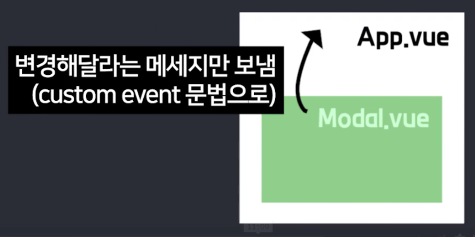

# 자식이 부모데이터 바꾸고 싶으면 custom event 로 메세지만 주십쇼

자식컴포넌트가 부모가 가진 데이터를 바꾸고 싶어할 때가 있습니다. 

하지만 그럴 순 없습니다. 애초에 다른 파일에 있는 거잖아요 그래서 못바꿈  

그리고 props로 전해준 데이터도 변경하시면 안됩니다. 변경하게 되면 많은 부작용이 일어나서 일부러 Vue 자체에서 변경 불가능하게 막아두기도 했습니다. 



그래서 부모가 가진 데이터를 바꾸고 싶으면 자식컴포넌트는 부모에게 메세지를 줘야합니다.

"부모야 저거 데이터 좀 바꿔줘" 이렇게 메세지를 주는겁니다.

부모는 그 메세지를 수신하면 데이터를 변경하는 코드를 짜놓으면 됩니다. 

이걸 custom event 문법이라고 합니다.  

custom event 문법을 이용한 부모가 가진 데이터변경방법을 요약하자면

1. 자식은 $emit(작명, 전달할자료) 이렇게 부모에게 메세지를 보낼 수 있습니다. 부모까지 자료를 전달하고 싶으면 선택적으로 기입가능합니다.

2. 부모는 @작명="데이터변경하는JS코드" 이렇게 메세지를 수신해서 원하는 데이터를 변경하도록 코드를 짭니다. 끝

귀찮죠? 그러니까 컴포넌트 만들 때 이런걸 감수할 이유가 있어야한다니까요. 

<br/>

## 제목 누르면 모달창 여는 기능 고치기

Card.vue 안에 상품제목이 있습니다.

상품제목 누르면 모달창이 열리게 만들고 싶어서 다음과 같이 코드를 작성했습니다. 

```html
(Card.vue)

<template>
  <div>
    
    <h4 @click="모달창열렸니 = true"> {{a.title}} </h4>
    <p>{{a.price}} 원</p>
   </div>
</template>
```
근데 안됩니다. 왜냐면 모달창열렸니는 App.vue 부모가 가지고 있는 데이터니까요.

부모가 가진 데이터를 변경하고 싶으면 자식은 부모에게 부탁만 할 수 있습니다. 예의바르게요

부탁하는 법은 $emit('작명', 전달할자료) 이 코드를 실행하면 됩니다.

$emit 이건 Vue가 제공하는 특별한 함수인데 부모에게 부탁하는 함수입니다. 

부탁이라고 비유했지만 실은 전문용어로 커스텀 이벤트 전송임 

<br/>

```js
(Card.vue)

<template>
  <div>
    
    <h4 @click="$emit('openModal')"> {{a.title}} </h4>
    <p>{{a.price}} 원</p>
   </div>
</template>
```

아무튼 이렇게 쓰시면 제목을 눌렀을 때 부모 컴포넌트에게 부탁하게 됩니다.

(실은 openModal이라는 이름으로 커스텀 이벤트를 전송하는 겁니다.)

<br/>

그럼 부모인 App.vue는 부탁을 받으면 데이터를 수정하면 됩니다.

모달창열렸니 = true 라고 해주면 모달창 열리니까 그렇게 합시다. 

```html
(App.vue)

<Card @openModal="모달창열렸니 = true"  />
```
이렇게 쓰면 부탁을 수신할 수 있습니다.

(실은 자식이 보낸 커스텀 이벤트를 수신하는 코드입니다)


아무튼 이제 상품제목을 누르면 부모에게 $emit으로 부탁하고

부모는 부탁이 들어오면 모달창열렸니를 true로 바꿔줍니다. 그럼 모달창 열리네요 끝

근데 다른 상품 눌러도 왜 똑같은 모달창만 열리는 겁니까? 

<br/>

## 커스텀 이벤트로 부모에게 자료 보내는 법

당연히 예전에 모달창열 때 

@click="모달창열렸니 = true; 누른거 = 1

이런 식으로 코드를 짜야 잘 동작했기 때문입니다. 

그래서 몇번 상품을 눌렀는지도 전달해서 App.vue에 저장해놔야합니다.  

```html
(Card.vue)

<template>
  <div>
    
    <h4 @click="$emit('openModal', 원룸.id)"> {{a.title}} </h4>
    <p>{{a.price}} 원</p>
   </div>
</template>
```
$emit()을 사용할 때 둘째 파라미터 자리에는 원하는 자료를 아무거나 입력가능합니다.

그럼 자료가 부모까지 전달이 됩니다.

그래서 원룸.id를 넣어봤습니다.


0번상품은 원룸.id가 0 

1번상품은 원룸.id가 1이기 때문에

몇번 눌렀는지 잘 전달될듯요

<br/>

부모는 $event라는 변수를 쓰면 그 보낸 자료가 담겨있습니다.

```html
(App.vue)

<Card @openModal="모달창열렸니 = true; 누른거 = $event"  />
```
아무튼 이렇게 해놓으면 예전과 똑같은 기능을 개발할 수 있겠군요. 

<br/>

그래서 요약하자면

자식이 부모 컴포넌트에 있는 데이터를 바꾸고 싶으면 

custom event 문법으로 부탁을 하셔야합니다. $emit(작명, 전달할자료) 이렇게 사용합니다.

부모는 <자식컴포넌트 @작명="부탁받으면할일"> 이렇게 해주면 됩니다.

 

- 밑에서 함수만들어서 사용하셔도 되는데

그럴 땐 this.$emit() 이라고 하셔야합니다. 