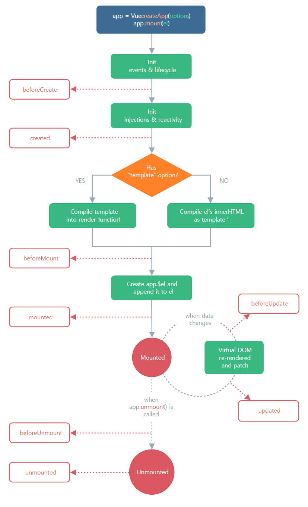

# Vue의 라이프사이클을 어디다 쓰냐면



뷰 공식문서 살펴보다보면 Lifecycle 이라고 설명하는 이상한 부분이 있습니다. 

대충 컴포넌트는 이런 step으로 생성되고 사라지고 업데이트 된다는 소리인데

이걸 왜 설명하고 있냐면 Lifecycle hook 이란걸 쓰기 위해서입니다. 

<br/>

1. 컴포넌트를 보여줄 때 create -> mount 이 단계로 생성됩니다. 

create는 데이터생성, mount는 index.html 파일에 장착 이렇게 생각하시면 됩니다. 

2. 데이터가 바뀌어서 컴포넌트가 재렌더링될 때는 update 단계를 거치며

3. 다른페이지로 이동하거나 그럴 때 컴포넌트가 삭제될 때는 unmount 라는 단계를 거칩니다. 

 

이 단계들 중간중간에 코드를 실행시키고 싶을 때가 있습니다. 

예를 들면 mount 되기 전에 뭔가 ajax 요청으로 서버에서 데이터를 가져오거나 

update 되기 전에 뭔가 코드를 실행해서 데이터를 검증해보거나 

이런 식입니다. 

그럴 때 lifecycle hook을 골라서 쓰면 됩니다. 

<br/>

```js
beforeCreate()
created()
beforeMount()
mounted()
beforeUpdate()
updated()
beforeUnmount()
unmounted()
```
대충 이렇게 있습니다. 함수명만 잘 읽어봐도 어떤 기능을 하는 함수인지 알 수 있겠군요. 

예를 들어서 beforeUpdate() 이건 언제 쓰는 함수겠습니까.

컴포넌트가 update되기 전에 뭔가 실행시키고 싶을 때 쓰는 함수입니다.

 

예를 들어서 mounted() 이건 언제쓰는 함수겠습니까.

컴포넌트가 mount 되고 나서 뭔가 실행시키고 싶을 때 쓰는 함수입니다.

```js
data(){
  return {
  
  }
},
mounted(){
  어쩌구~
}
```
대충 컴포넌트 파일 하단에 저런 식으로 쓰면 됩니다. 그럼 mount가 되고나서 어쩌구~라는 코드를 실행해줍니다. 

특히 서버가 있으면 서버에서 데이터 가져오는 일이 잦은데

데이터가져오는 코드를 mounted() 아니면 created() 여기에 보통 작성합니다.