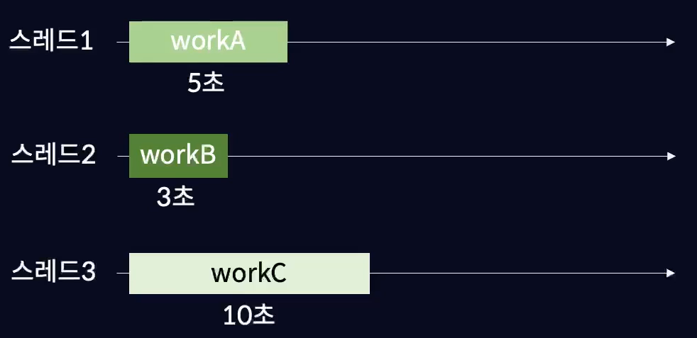

# 비동기 처리

## 동기란

하나의 작업이 실행되는 동안은 다른 작업을 동시에 진행하지 않는 방식 <br/>
앞의 작업이 종료된 이후 다음 작업을 진행할 수 있는 순차적인 방식.

지금까지 작성한 코드들은 전부 동기적으로 진행 됨.
```js
console.log('a'); // a
console.log('b'); // b
console.log('c'); // c
```

<br/>

다음과 같은 코드가 있다고 가정했을 때,

```js
const workA = () => { //5초
    console.log('workA');
}

const workB = () => { //3초
    console.log('workB');
}

const workC = () => { //10초
    console.log('workC');
}

workA();
workB();
workC();
```

이러한 작업들을 동기적으로 처리한다면

1. workA를 5초동안 처리
2. workA가 끝나면 workB를 3초동안 처리
3. workB가 끝나면 workC를 10초동안 처리

=> 총 18초 소요

위와 같은 방식으로 진행 됨. <br/>
하나의 작업이 종료 된 이후에 다른 작업을 처리할 수 있는 방식을 **블로킹 방식** 이라고 함.

<br/>

오래 걸리는 작업을 먼저 수행해야할 경우, 동기적으로 실행하면 작업시간이 매우 길어지게 됨. (= 성능 상의 문제)

<br/>

### 그럼 스레드를 하나가 아니라 여러개 사용하면 되는거 아님?

*스레드 : 프로그램에서 작업들을 처리하는 주체



스레드를 여러개 만들어서 각각의 스레드마다 작업을 할당해준 다음,
여러 작업들을 동시에 할 수 있게 하는 멀티 스레드 방식을 사용하면 되는 것이 아닌가? 할 수도 있겠지만... <br/>

자바스크립트는 싱글 스레드 방식의 언어라서 불가능.

=> 이러한 문제점을 해결하기 위해 하나의 스레드에서 여러 작업들을 동시에 처리하는 **비동기** 처리로 작업을 수행할 수 있음.

<br/><br/>

## 비동기 처리란
어떠한 작업이 종료되기를 기다리지 않고, 다음 작업도 동시에 진행하는 방식. (= 여러 작업들을 동시에 진행)


하나의 스레드에서 3개의 작업을 동시에 처리할 수 있음. <br/>

하나의 스레드에서 여러 작업을 동시에 처리하는 방식을 **논 블로킹** 방식이라고 함.

<br/>

### 비동기 setTimeout

- setTimeout은 파라미터로 전달받은 시간 만큼 기다렸다가 작업을 수행함.

```js
setTimeout(() => {
    console.log('3초만 기다리세요');
},3000);

// (3초 후...) 3초만 기다리세요
```

<br/>

- setTimeout이 비동기로 처리되기 때문에, 3초를 기다리지 않고 `console.log('종료')` 가 먼저 실행되고 그 다음에 setTimeout 작업이 수행 됨.

```js
setTimeout(() => {
    console.log('3초만 기다리세요');
},3000);

console.log('종료');

/*
종료
(3초 후...) 3초만 기다리세요
*/
```

<br/>

- 3초만 기다리세요 다음에 종료라는 문장이 나오게 할려면 콜백 함수를 사용해 해당 코드를 인수로 넘겨야 함. 

```js
const work = (callback) => {
    setTimeout(() => {
        console.log('3초만 기다리세요');
        callback();
    },3000);
}

work(() => {
    console.log('종료');
});

/*
3초만 기다리세요
종료
*/
```

<br/>

- 아래 코드에선 workD 빼고는 전부 비동기적으로 동작하기 때문에, workD가 먼저 출력되고 그다음 workB workA workC 순으로 출력 됨.

```js
const workA = () => {
    setTimeout(() => {
        console.log('workA');
    }, 5000);
}

const workB = () => {
    setTimeout(() => {
        console.log('workB');
    }, 3000);
}

const workC = () => {
    setTimeout(() => {
        console.log('workC');
    }, 10000);
}

const workD = () => {
    console.log('workD');
}

workA();
workB();
workC();
workD();

/*
workD
workB
workA
workC
*/
```