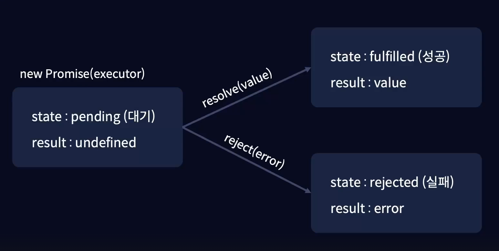

# Promise 객체

비동기 작업을 더 편리하게 처리할 수 있음.

<br/>

- 동기 함수인 workD가 먼저 출력되고, 이후 workB -> workA -> workC 순으로 출력됨. <br/>

- workB 함수는 workB라는 단어와 파라미터로 전달받은 값을 출력하는 함수를 인수로 전달함.

- workB 함수에서 value 는 workB를 받고, callback은 파라미터로 전달받은 값을 출력하는 함수를 전달받음.

- 이후 setTimeout 콜백 함수에서 workB가 3초뒤에 출력 됨. (workA,workC도 동일)

```js
const workA = (value, callback) => {
    setTimeout(() => {
        callback(value);
    }, 5000);
}

const workB = (value, callback) => {
    setTimeout(() => {
        callback(value);
    }, 3000);
}

const workC = (value, callback) => {
    setTimeout(() => {
        callback(value);
    }, 10000);
}

const workD = (value, callback) => {
    callback(value);
}

workA("workA", (res) => {
    console.log(res);
});

workB("workB", (res) => {
    console.log(res);
});

workC("workC", (res) => {
    console.log(res);
});

workD("workD", (res) => {
    console.log(res);
});

/*
workD
workB
workA
workC
*/
```

<br/>

## 콜백 지옥

- workD가 동기적으로 처리되어 가장 먼저 출력되고, 비동기 함수에서 결과값을 계속해서 전달 해야하기 때문에 workA, workB , workC가 순서대로 출력됨.

- 결과값을 또 다른 비동기 함수에서 사용하기 위해 콜백함수 안에 콜백함수를 전달하는 방식으로 전달하게 되면 함수의 실행 순서를 알기 쉽고, 유연한 프로그래밍을 할 수 있지만 가독성이 매우 좋지 않은 코드가 됨.

- 꺽쇠 모양으로 복잡하게 생긴 코드를 **콜백지옥** 이라고 함. 콜백지옥은 Promise 객체라는 것을 사용해 해결할 수 있음.

```js
const workA = (value, callback) => {
    setTimeout(() => {
        callback(value + 5);
    }, 5000);
}

const workB = (value, callback) => {
    setTimeout(() => {
        callback(value - 3);
    }, 3000);
}

const workC = (value, callback) => {
    setTimeout(() => {
        callback(value - 10);
    }, 10000);
}

const workD = (value, callback) => {
    callback(value);
}

/* 콜백 지옥 
콜백함수에서 콜백을 전달하고 또 전달하고 또 전달 ...
*/
workA(10, (resA) => {
    console.log(`1. ${resA}`);

    workB(resA, (resB) => {
        console.log(`2. ${resB}`);

        workC(resB, (resC) => {
            console.log(`3. ${resC}`);
        });
    });
});

workD("workD", (res) => {
    console.log(res);
});

/*
workD
1. 15
2. 12
3. 22
*/
```

<br/><br/>

## Promise 객체 생성

- new 키워드를 통해 Promise 객체를 생성
- Promise 객체는 인수로 executor 라는 실행 함수를 전달함.
executor는 resolve랑 reject라는 콜백 함수를 가지고 있음.

*resolve / reject : 자바스크립트에서 자체적으로 제공하는 콜백 함수로, executor는 비동기 처리가 성공하면 resolve, 실패하면 reject를 호출함. <br/>
비동기 작업은 성공하거나 실패할 수 있기 때문에 resolve와 reject 둘 중 하나는 반드시 호출해야 함. 

*실행함수: Promise 생성자에 반드시 들어가야 하는 함수이며, 작업을 비동기로 처리하는 함수.

- executor 함수를 Promise 객체에 항상 전달 해주어야 함.
- executor 함수는 Promise 객체를 생성함과 동시에 실행되는 실행함수임.

```js
const executor = (resolve, reject) => {
    setTimeout(() => {
        console.log('3초만 기다리세요');
    }, 3000);
}

const promise = new Promise(executor);

// 3초만 기다리세요
```

<br/>

## 프로미스 객체의 내부 프로퍼티



- executor가 실행되고 처음엔 대기 상태.

=> resolve가 호출되면 상태를 fulfilled, result는 value 로 변경

=> reject가 호출될 경우 상태를 rejected, result는 error 로 변경

프로미스 객체의 상태는 resoluve와 reject로 변하지만, 한번 변경된 상태에서는 더 이상 변하지 않기 때문에 <br/> 

**처리가 끝난 프로미스 객체** 에 resolve 또는 reject를 호출하면 무시 된다는 것을 주의해야 함.

<br/>

## resolve / reject 사용법

### resolve

- 비동기 처리된 결과 값을 반환할 경우 파라미터로 받은 resolve 콜백 함수에 결과값을 전달하면 됨.

- resolve에 전달된 값을 promise 객체의 then 메서드를 이용해 사용할 수 있고, executor에서 전달한 성공이라는 값을 콜백함수에 파라미터로 전달받을 수 있음.

#### 코드 설명

1. promise 객체가 생성됨과 동시에 executor 함수가 실행되고, executor에서 파라미터로 받은 콜백함수들 중 resolve 함수를 사용해 성공이라는 값을 전달.

2. 이 때 promise 객체의 state는 pending => fulfilled로,result는 undefined => 성공으로 변경.

3. then 메서드를 통해 promise 객체의 result 값을 파라미터로 받아 콘솔에 출력.

```js
const executor = (resolve, reject) => {
    setTimeout(() => {
        //결과값 작성
        resolve('성공');
    }, 3000);
}

const promise = new Promise(executor);

//resolve에서 전달한 값을 파라미터로 받아서 사용가능.
promise.then((res) => {
    console.log(res);
});

// 성공
```

<br/>

### reject

- reject 함수가 실행되었기 때문에 promise 객체의 state는 pending => rejected, result는 undefined => 실패로 변경.

- reject의 경우는 then이 아닌 catch 메서드를 사용해야 함.

```js
const executor = (resolve, reject) => {
    setTimeout(() => {
        reject('실패')
    }, 3000);
}

const promise = new Promise(executor);

promise.then((res) => {
    console.log(res);
}).catch((err) => {
    console.log(err);
});

// 실패
``` 

<br/>

## promise를 사용한 비동기 함수 작성

```js
const workA = (value) => {
    const promise = new Promise((resolve,reject) => {
        setTimeout(() => {
            resolve(value+5);
        },5000);
    });

    return promise;
}

const workB = () => {
    const promise = new Promise((resolve,reject) => {
        setTimeout(() => {
            resolve(value-3);
        },3000);
    });

    return promise;
}

const workC = () => {
    const promise = new Promise((resolve,reject) => {
        setTimeout(() => {
            resolve(value+10);
        },10000);
    });

    return promise;
}

/* promise를 사용했지만 여전히 콜백지옥 문제는 남아있음. */

// workA(10).then((resA) => {
//     console.log(`1. ${resA}`);

//     workB(resA).then((resB) => {
//         console.log(`2. ${resB}`);

//         workC(resB).then((resC) => {
//             console.log(`3. ${resC}`);
//         });
//     })
// });

/* promise 객체를 반환하며 then 메서드를 연속으로 사용함. (프로미스 체이닝) */
workA(10).then((resA) => {
    console.log(`1. ${resA}`);
    return workB(resA); // 해당 함수가 반환되면 workB 함수의 프로미스 객체가 반환되기 때문에 then 메서드를 다시 사용할 수 있음.
}).then((resB) => {
    console.log(`2. ${resB}`);
    return workC(resB);
}).then((resC) => {
    console.log(`3. ${resC}`);
})

/*
1. 15
2. 12
3. 22
*/
```