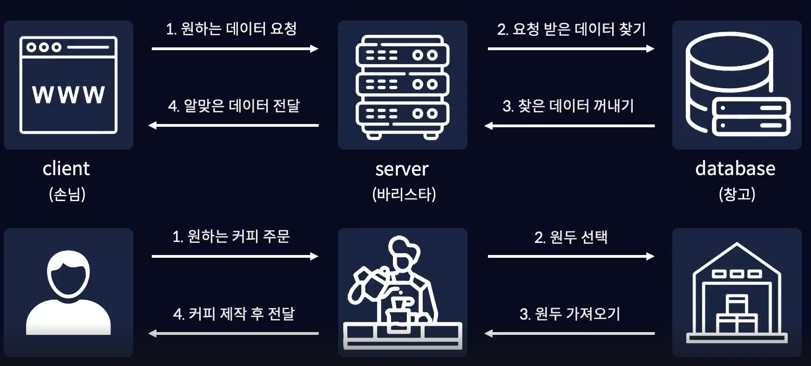
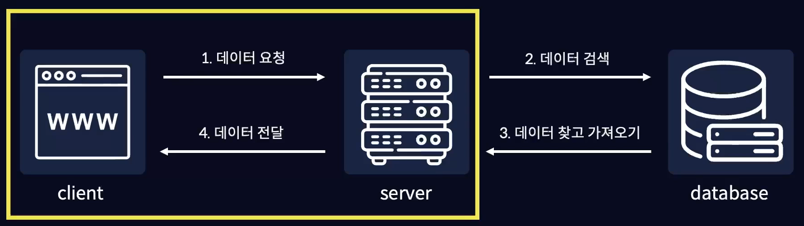
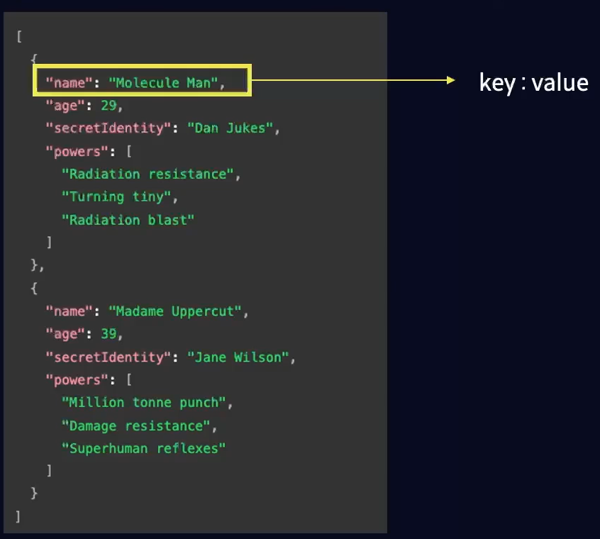

# API 호출

## API란 
> API (application programming interface) 는 컴퓨터나 컴퓨터 프로그램 사이의 연결이다. 일종의 소프트웨어 인터페이스이며 다른 종류의 소프트웨어에 서비스를 제공한다.



1. 브라우저가 서버에게 원하는 데이터를 요청
2. 서버는 요청 받은 데이터를 데이터베이스에서 찾고
3. 데이터베이스에서 찾은 데이터를 꺼내온 다음
4. 꺼내온 데이터를 서버가 브라우저에게 전달



API는 웹 브라우저와 같은 클라이언트와 서버 사이의 연결이라고 할 수 있고, 서버에 원하는 데이터를 요청하고 전달받는 방법이라고 할 수 있음.

<br/>

## JSON

자바스크립트 객체 표기법 (Javascript Object Notation)으로,
객체 형태의 데이터를 가독성 좋게 나타내기 위한 표기법.



JSON 형식은 보통 데이터를 전송할 때 사용되며, key value로 이루어져 있음.

<br/>

## API 호출하기

- `fetch()` 는 프로미스 객체를 반환하는 비동기 처리 함수이기 때문에 response를 출력하는 코드가 먼저 실행되었고, 이후 프로미스에서 resolve 함수로 출력된 결과값을 then 메서드에서 파라미터로 전달받아 api 호출의 결과값이 출력 됨.

- `fetch()` 를 통해 API를 호출하면 Response 라는 API 성공 객체를 반환하기 때문에 JSONplaceholder와는 다른 값이 출력되어 있음.

```js
const response = fetch("https://jsonplaceholder.typicode.com/posts").then((res) => 
console.log(res))
.catch((error) => console.log(error));

console.log(response);

/*
Promise {<pending>}
Response {Response 객체}
*/
```

- `.json()` 이라는 메서드로 JSON으로 이루어진 데이터들을 파싱하여 객체 형태로 변환함.

- fetch 함수는 비동기적으로 처리되기 때문에 api의 호출이 완전히 끝난 이후에 res를 객체로 변환해주기 위해 await 키워드를 작성. await을 기준으로 아래에 작성된 코드들은 해당 함수가 처리 된 이후에 처리됨.

- res라는 JSON 데이터를 객체 형태로 파싱하는 것이 완료된 이후에 data라는 값을 출력해야 하기 때문에 앞에 await 키워드 작성.

```js
const getData = async () => {
    const res = await fetch("https://jsonplaceholder.typicode.com/posts");
    const data = await res.json();
    console.log(data);
}

getData();

// (100) [Object, Object, Object ...]
```

<br/>

### 에러처리

api 호출은 필요한 데이터를 전달받기 위해 데이터를 요청하는 작업임. <br/> 
데이터를 요청할 때에는 우리의 컴퓨터가 아닌 다른 서버에 요청하는 경우가 많기 때문에 네트워크 오류나 인터넷 속도 등에 **다양한 이유로 실패할 수 있음.**<br/> 

그렇기 때문에 api 호출처럼 성공할수도, 실패할수도 있고 작업이 언제 종료될지도 모르는 작업들을 비동기적으로 처리하고 **항상 오류가 발생할 상황을 대비** 해서 에러처리를 해주어야 함.

- try문 내부에 코드들이 먼저 실행되고, 오류가 발생해 catch문에 있는 에러가 출력 됨.

```js
const getData = async () => {
    try{
        const res = await fetch("https://jsonplaceholder123123.typicode.com/posts");
        const data = await res.json();
        console.log(data);
    } catch(error){
        console.log(error);
    }
}

getData();
```