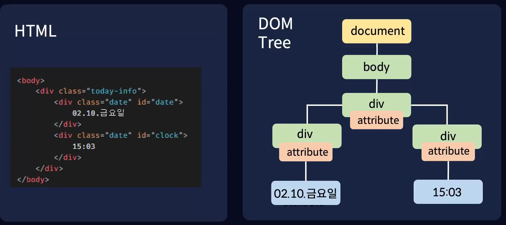

# 웹 페이지를 조작하는 DOM

## 웹 이란
인터넷에 연결된 사용자들이 서로의 정보를 공유할 수 있는 공간

 

## HTML (Hyper Text Markup Language)
브라우저에게 웹 사이트의 요소들이 어떻게 구성 되어있는지 알려주는 역할

 

## CSS (Cascading Style Sheet)
웹 사이트의 요소들을 꾸며주는 역할

 

## DOM 이란

문서 객체 모델 (Documnet Object Model) 
HTML을 자바스크립트가 이해할 수 있게 객체로 변환 한 것.

 

## DOM API

DOM이 제공하는 DOM을 조작하고 수정할 수 있는 방법