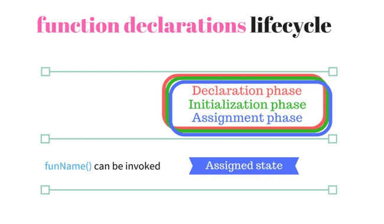
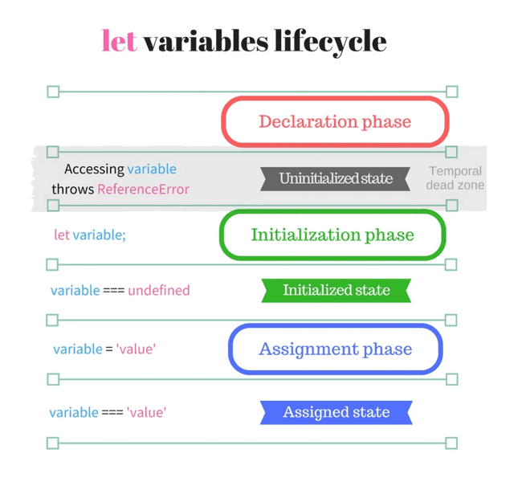
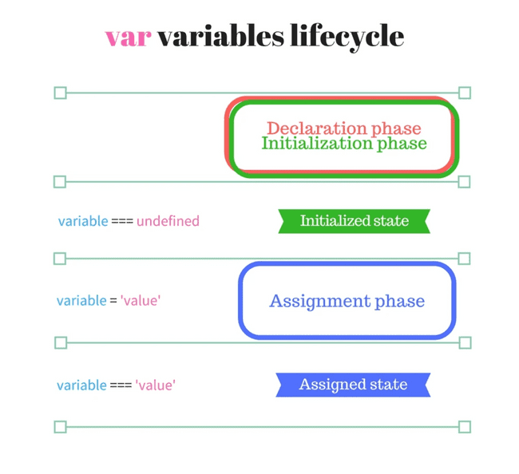
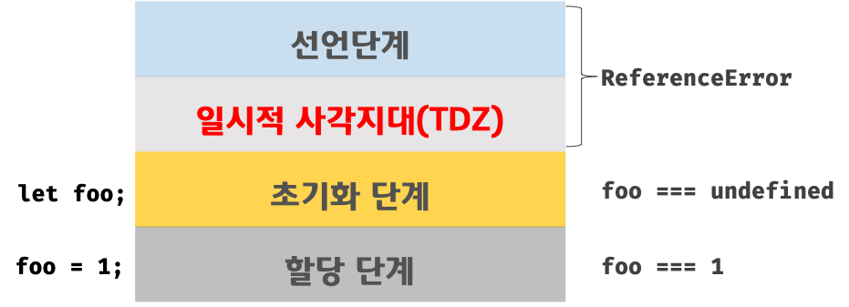
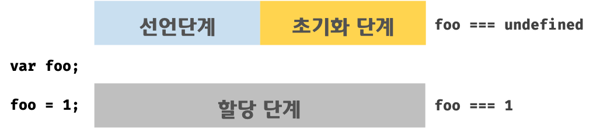

# 호이스팅

아직 선언되지 않은 함수나 변수들을 <br/>
해당 스코프의 맨 위로 끌어올려 사용하는 작동 방식

<br/>

## 함수 호이스팅



함수 호이스팅은 선언,초기화,할당을 모두 동시에 진행하기 때문에 TDZ가 존재하지 않음.

<br/>

자바스크립트에서는 함수 호출문을 선언문보다 먼저 작성해도 자바스크립트가 호출문을 알아서 선언문 아래에 있는 코드로 받아들여서 작동하게 됨.

```js
print();

function print() {
    console.log('hello world');
}
```

<br/>

## 자바스크립트에서의 변수 처리

자바스크립트는 총 3단계에 걸쳐서 변수를 생성함.

1. 선언 단계(Declaration phase)

- 변수 객체(Variable Object)를 생성하고 변수를 등록한다.
- 스코프는 해당 변수 객체를 참조한다.

2. 초기화 단계(Initialization phase)

- 변수 객체(Variable Object)에 등록된 변수를 메모리에 할당한다.
- 변수는 undefined로 초기화된다.

3. 할당 단계(Assignment phase)

- undefined로 초기화된 변수에 실제값을 할당한다.


### let, const


- let은 선언과 초기화 단계가 분리되어 있고, 그 사이에 TDZ가 있음.
- const는 선언과 초기화가 동시에 실행됨. 하지만 그 전에 TDZ가 생성되어 에러가 출력됨.


### var


- var는 TDZ가 없고, 선언과 초기화가 동시에 진행되며, 선언과 동시에 **undefined** 로 초기화 됨.

<br/>

## 변수 호이스팅

선언되지 않은 변수를 출력해보면 10이 아닌 undefined가 출력됨. <br/>

변수의 선언문만 해당 스코프의 최상단으로 올려 해석하고, 할당된 값은 호이스팅 되지 않음. 

```js
console.log(num); //undefined

var num = 10;

/* ========================== */

var num;
console.log(num);
num = 10;
```

### TDZ (Temporal Dead Zone)



일시적인 사각지대 <br/>
스코프의 시작 지점부터 초기화 시작 지점까지의 구간.

```js
// num1이 10으로 할당 되기 전까지는 TDZ에 있음.
console.log(num1);
let num1 = 10;

// num2가 15로 할당 되기 전까지는 TDZ에 있음.
console.log(num2);
const num2 = 15;
```

=> let과 const는 호이스팅이 발생하지 않는 것이 아니라, 변수 선언은 되었으나 초기화가 되지 않았기 때문에 (변수를 위한 메모리 공간이 아직 확보 되지 않았기 때문에) 변수를 참조할 수 없음.<br/>

해당 구간을 TDZ라고 함.

<br/>



```js
console.log(num);
var num = 10;
```

var는 변수를 생성한 다음, 바로 메모리에 공간을 할당함.

```js
console.log(num1);
let num1 = 10;

console.log(num2);
const num2 = 15;
```

let과 const는 변수가 초기화 되기 전까지는 메모리 공간이 확보되지 않은 상태이기 때문에 TDZ에 있는 것임.

<br/>

### 호이스팅이 좋은 것인가?

호이스팅이 많이 발생하게 되면, 가독성이 떨어지고 이해가 어렵게 되어 오류를 발생시킬 수 있음.

```js
console.log(num1); //undefined
console.log(num2); //undefined

var num1 = 10;

console.log(num1 + 20); // 30

var num2 = 5;
```

```js
let num1 = 10;
console.log(num1); //10
console.log(num1 + 20); //30

let num2 = 5;

console.log(num2); //5
```

<br/><br/>

## 참고

https://yoo11052.tistory.com/151
https://poiemaweb.com/es6-block-scope